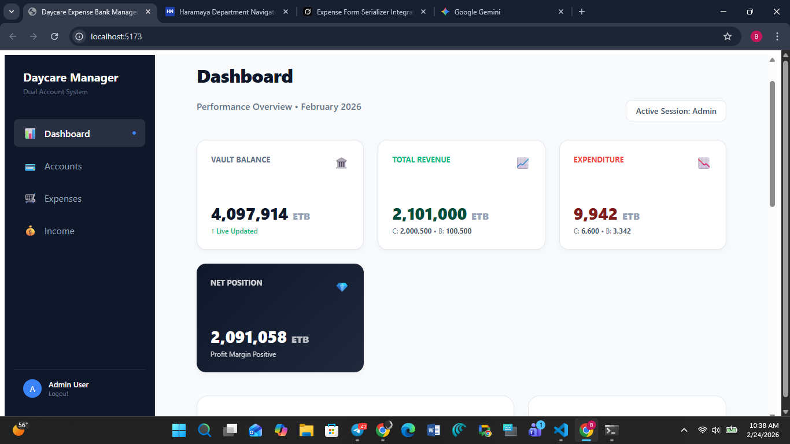
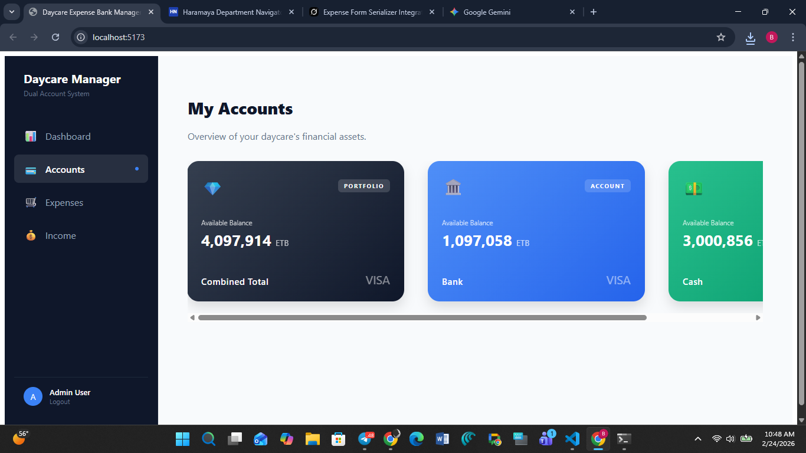

# 🏫 DayCare Expense Management System – Frontend

A modern **frontend application** for managing **DayCare expenses**, built to work seamlessly with a dedicated backend API. This system helps DayCare administrators **record, track, and analyze expenses** in a structured, accurate, and user-friendly way.

---

## 📌 Project Overview

The **DayCare Expense Management Frontend** is designed to simplify financial tracking for DayCare centers. It allows users to:

* Record daily and monthly expenses
* Manage expense items (quantity, unit price, totals)
* Categorize expenses (e.g., Stationery, Food, Utilities)
* Track VAT-enabled and non-VAT expenses
* View paginated expense history
* Integrate securely with a backend API

This frontend consumes a **RESTful backend service** and focuses on **performance, scalability, and clean UI/UX**.

---

## 🛠️ Tech Stack

### Frontend

* **React + TypeScript** – Component-based UI with strong typing
* **Redux Toolkit** – Global state management
* **RTK Query** – Data fetching, caching, and API state management
* **Vite** – Fast development and build tooling
* **Tailwind CSS / CSS Modules** – Responsive UI styling

### Backend Integration

* REST API (JSON-based)
* Token-based authentication (if enabled)
* Pagination support (`count`, `next`, `previous`)

---

## 🔗 Backend Integration Architecture

The frontend communicates with the backend using **RTK Query**, which provides:

* Automatic caching
* Request deduplication
* Loading & error state handling
* Strong TypeScript integration

### Example API Response Structure

```json
{
  "count": 1,
  "next": null,
  "previous": null,
  "results": [
    {
      "id": 1,
      "items": [],
      "date": "2026-01-17",
      "category": "Stationery",
      "total_expense": "150.00"
    }
  ]
}
```

---

## 📁 Project Folder Structure

```text
src/
│── app/
│   └── store.ts            # Redux store configuration
│
│── services/
│   └── expenseApi.ts       # RTK Query API definitions
│
│── features/
│   └── expenses/           # Expense-related components & logic
│
│── components/
│   ├── ExpenseList.tsx
│   ├── ExpenseForm.tsx
│   └── ExpenseItem.tsx
│
│── types/
│   └── expense.ts          # TypeScript interfaces
│
│── App.tsx
│── main.tsx
```

---

## 🧩 Core Features

### 1️⃣ Expense Management

* Create, update, and view expenses
* Add multiple items per expense
* Automatic total calculation

### 2️⃣ VAT Handling

* Enable/disable VAT per expense
* Configurable VAT rate
* Backend-calculated VAT amount displayed in UI

### 3️⃣ Category & Supplier Tracking

* Categorize expenses for reporting
* Track suppliers and payment sources

### 4️⃣ Pagination & Performance

* Backend-driven pagination
* Optimized rendering for large datasets

---

## 🔐 Authentication & Security (If Enabled)

* Token-based API requests
* Secure storage of auth tokens
* Protected routes for authorized users

---

## ⚙️ Environment Configuration

Create a `.env` file:

```env
VITE_API_BASE_URL=https://your-backend-api.com/api
```

---

## ▶️ Running the Project

```bash
# Install dependencies
npm install

# Start development server
npm run dev

# Build for production
npm run build
```

---

## 🎯 Design Principles

* **Scalability** – Easy to extend with reports & dashboards
* **Maintainability** – Clean folder structure & typed APIs
* **Accuracy** – Financial values handled carefully
* **Usability** – Simple workflows for non-technical users

---

## 🚀 Future Enhancements

* Expense analytics dashboard
* Export reports (PDF / Excel)
* Role-based access control
* Multi-branch DayCare support

---

## 🤝 Contribution Guidelines

* Follow TypeScript best practices
* Keep components small and reusable
* Ensure API changes are reflected in types

---

## 📄 License

This project is developed for **DayCare financial management** and is intended for internal or licensed use.

---

### ✅ Summary

This frontend application provides a **robust, scalable, and user-friendly solution** for managing DayCare expenses while maintaining **tight integration with the backend** for accuracy and performance.

---

📌 *Built to make DayCare expense tracking simple, transparent, and reliable.*


Account page
